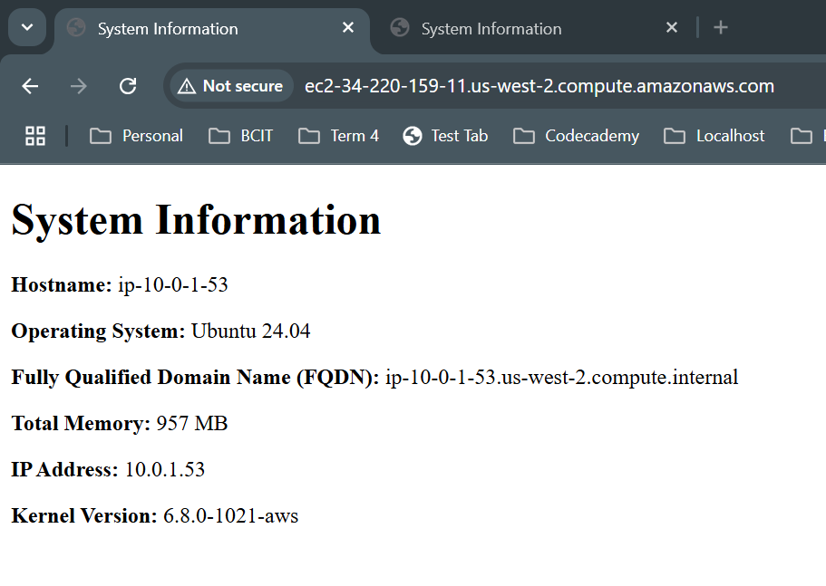

# 4640-w7-lab-start-w25

## Generating the aws key
ssh-keygen -t ed25519 -f ~/.ssh/aws -C "Your comment here"

## Using the existing script to import 
./import_lab_key ~/.ssh/aws

## Check for syntax errors
ansible-playbook --syntax-check playbook.yml

## Run the playbook
ansible-playbook playbook.yml

